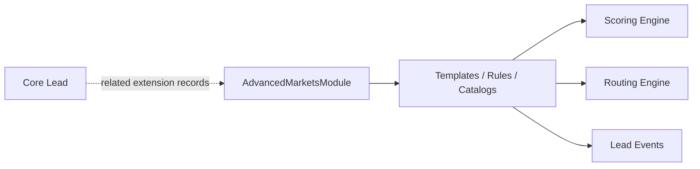

# Advanced Markets Module

## Intent

`AdvancedMarketsModule` is the first **industry accelerator**. It configures the core Growth OS for insurance and financial professionals serving business owners and high-value prospects — without turning the core into an insurance-only CRM.

## Module boundary



Advanced Markets extends through:

- Campaign templates
- Qualification templates (Stage 1 engagement)
- Lead-scoring rule packs
- Lead categories / temperature overlays
- Strategy classifications (internal routing only — not consumer recommendations)
- Agent licensing rules
- Distribution / routing overlays
- Subscription entitlements
- Lead marketplace rules (future)
- Follow-up / nurture sequences

## What Advanced Markets must NOT do

- Replace or subclass the core `Lead` entity into an “insurance lead”
- Hard-code compliance-sensitive eligibility determinations in application UI
- Present strategy classifications to consumers as financial advice/recommendations
- Guarantee lead quality or regulatory fitness

## Registration model (conceptual)

```ts
type AcceleratorModule = {
  key: "advanced_markets" | string;
  displayName: string;
  registers: {
    campaignTemplates: boolean;
    qualificationTemplates: boolean;
    scoringRulePacks: boolean;
    strategyCatalog: boolean;
    routingOverlays: boolean;
    entitlementOverlays: boolean;
    nurtureSequences: boolean;
  };
};
```

Organizations enable accelerators via entitlements / settings. Core features remain available without Advanced Markets.

## Stage 1 — Engagement qualification

Prospects arriving from ads/campaigns complete **3–5 engaging questions** in ~30–90 seconds:

- Create engagement
- Identify intent
- Determine general opportunity
- Capture contact information
- Suggest potential internal strategy fit
- Encourage appointment scheduling

Stage 2 (deeper fact-find / application-like flows) is deferred and must remain optional, versioned, and compliance-reviewed.

## Strategy classifications (internal)

Conceptual categories (extensible, not hard-coded forever):

- Tax Strategy
- Business Owner Planning
- Executive Benefits
- Key Person Planning
- Buy-Sell Planning
- Estate Planning
- Succession Planning
- Retirement Strategy
- Premium Financing
- High-Value Life Planning
- General Protection

Stored per lead (many): `strategy_category`, `strategy_confidence`, `classification_reason`, `classification_version`.

## Compliance posture

Design for consent, communication preferences, opt-out, audit logging, retention, provenance, RBAC, licensing/territory controls, campaign compliance review, and versioned qualification logic.

**The software does not determine regulatory eligibility.** Business/compliance rules are configurable and reviewable by humans.
