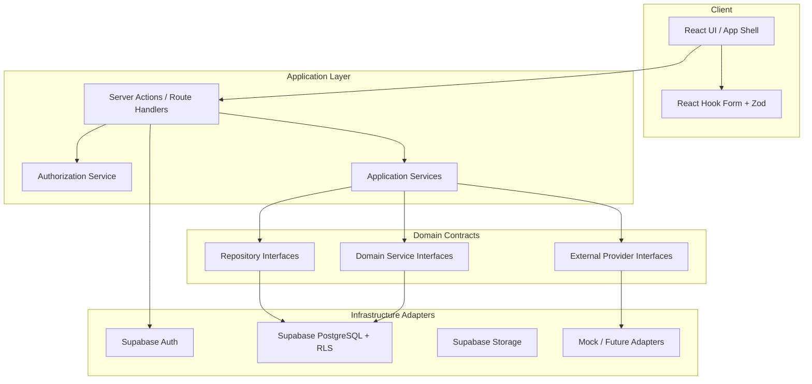

# Architecture

## Overview

The Growth Operating System is a Next.js App Router application with a clear separation between presentation, application services, domain contracts, and infrastructure adapters.



## Layering rules

1. **UI** renders state and collects input. No SQL, no permission math, no scoring/routing rules.
2. **Application services** orchestrate use cases and call domain interfaces.
3. **Domain interfaces** define repositories, scoring/routing services, and external providers.
4. **Infrastructure** implements interfaces (Supabase first; Dynamics/Dataverse later).

## Domain interfaces (required)

### Repositories

- `OrganizationRepository`
- `UserRepository`
- `CampaignRepository`
- `LeadRepository`
- `ContactRepository`
- `OpportunityRepository`
- `ActivityRepository`

### Domain services

- `LeadScoringService`
- `LeadRoutingService`

### External providers

- `CommunicationProvider`
- `CalendarProvider`
- `CRMProvider`
- `ContactCenterProvider`
- `AnalyticsProvider`

## Supabase responsibilities (v1)

| Concern | Implementation |
| --- | --- |
| Auth | Supabase Auth (email magic link / password as configured) |
| Data | PostgreSQL via Supabase client (server preferred) |
| Isolation | RLS policies keyed on organization membership |
| Files | Supabase Storage with org-scoped paths |
| Secrets | Service role key server-only |

## Future Microsoft path

Frontend continues to call the same domain interfaces. New adapters implement:

- Dataverse / Dynamics entities via `CRMProvider` and repositories
- Entra ID as an alternate identity source
- Azure Communication Services behind `CommunicationProvider`
- Contact Center behind `ContactCenterProvider`
- Azure Functions / APIM for orchestration

See [d365-future-state.md](./d365-future-state.md).

## Application structure

```text
src/
  app/                 # Next.js routes (App Router)
  components/          # UI components (no business rules)
  domain/
    interfaces/        # Repository & provider contracts
    types/             # Shared domain types
    permissions/       # Permission keys & role maps
  application/         # Use-case services
  infrastructure/
    supabase/          # Clients + repository implementations
    providers/         # External provider stubs
  lib/                 # Cross-cutting utilities
  styles/              # Global styles / design tokens
supabase/
  migrations/          # SQL migrations + RLS
docs/                  # Product & architecture docs
```

## Auth & tenancy flow (high level)

1. User authenticates → Supabase session.
2. Server resolves `profile` and active `organization_member`.
3. Authorization service evaluates permission keys for the action.
4. Queries always filter by `organization_id`; RLS enforces the same constraint.

## UI system

Premium enterprise SaaS shell: strong typography, generous spacing, sophisticated cards, accessible color contrast, responsive layout, and first-class empty/loading/error states. Navigation destinations are present as placeholders until feature branches deepen them.
