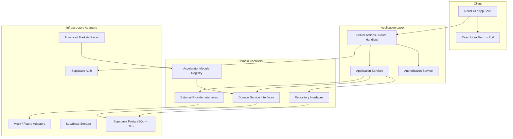

# Architecture

## Overview

FinancePlatform is a Next.js App Router Growth + Distribution Operating System with clear separation between presentation, application services, domain contracts, and infrastructure adapters.

Product layers: **Core Platform** + **Industry Accelerators** (first: Advanced Markets). See [platform-layers.md](./platform-layers.md).



## Layering rules

1. **UI** renders state and collects input. No SQL, permission math, scoring, routing, or recycling rules.
2. **Application services** orchestrate use cases and call domain interfaces.
3. **Domain interfaces** define repositories, intelligence services, and external providers.
4. **Accelerators** register templates and rule packs; they do not fork core entities.
5. **Infrastructure** implements interfaces (Supabase first; Dynamics/Dataverse later).

## Domain interfaces

### Repositories (core)

- `OrganizationRepository`, `UserRepository`, `CampaignRepository`, `LeadRepository`, `ContactRepository`, `OpportunityRepository`, `ActivityRepository`
- `LeadEventRepository`, `QualificationTemplateRepository`, `CampaignTemplateRepository`

### Domain services (core intelligence)

- `LeadScoringService` — event-driven, configurable rule packs
- `LeadClassificationService` — strategy classifications
- `LeadRoutingService` — eligibility-aware distribution
- `TerritoryEligibilityService`
- `LeadLifecyclePolicyService` — dormancy / recycle eligibility
- `LeadNurtureService`

### External providers

- `CommunicationProvider`, `CalendarProvider`, `CRMProvider`, `ContactCenterProvider`, `AnalyticsProvider`, `BillingProvider`

### Accelerators

- `AdvancedMarketsModule` registry / pack descriptors (not a separate app)

## Application structure

```text
src/
  app/
  components/
  domain/
    interfaces/
    types/
    permissions/
    accelerators/      # module keys + pack types
  application/
  infrastructure/
    supabase/
    providers/
supabase/migrations/
docs/
```

## Auth & tenancy

Unchanged: session → profile → organization_member → permissions; RLS on `organization_id`.

## Dashboards (future UX; architecture-ready)

**Agent:** today queue (new/hot/appointments/follow-ups/tasks), pipeline columns, lead detail (score, temperature, strategies, source, timeline, appointment, notes, tasks, communications).

**Organization:** volume, quality distribution, campaign performance, response time, appointment/show rates, pipeline value, close rate, revenue attribution, agent/territory/strategy performance.

## Related docs

- [advanced-markets-module.md](./advanced-markets-module.md)
- [qualification-engine.md](./qualification-engine.md)
- [lead-intelligence.md](./lead-intelligence.md)
- [monetization-and-marketplace.md](./monetization-and-marketplace.md)
- [architecture-impact-advanced-markets.md](./architecture-impact-advanced-markets.md)
- [d365-future-state.md](./d365-future-state.md)
