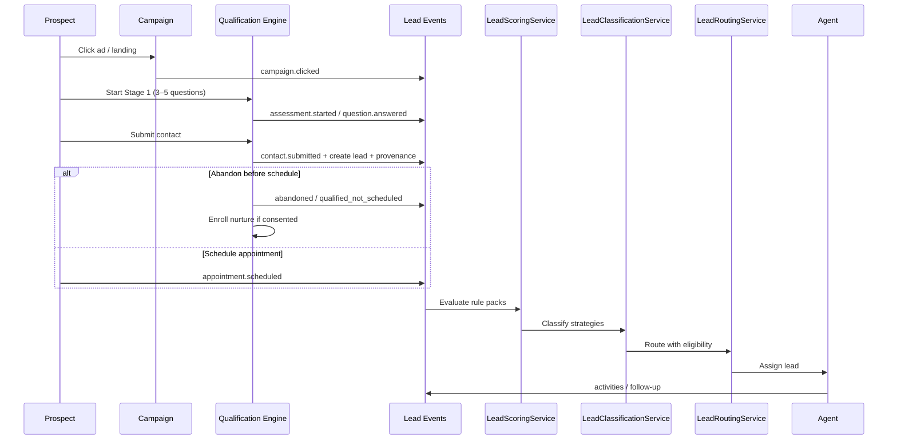
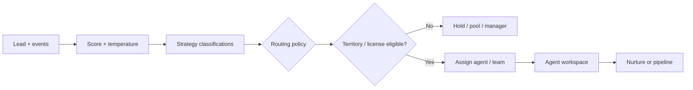

# Campaign and Lead Flow

## Product journey

```text
Marketing → Campaign → Interactive Qualification → Lead Capture → Lead Intelligence
→ Lead Scoring → Lead Classification → Appointment → Lead Routing → Agent/Advisor
→ CRM → Follow-Up → Opportunity → Closing → Retention → Referral
```

## Campaign → lead journey (expanded)



## Lead routing flow



## Campaign catalog (accelerator-supplied templates)

Org selects growth objective (e.g. Tax Strategy, Business Owner Planning, Executive Benefits, Estate, Retirement, General Protection) then configures:

Campaign + Territory + Audience + Budget + Lead target + Qualification profile → campaign configuration from reusable templates.

## Foundation vs next builds

| Capability | Status |
| --- | --- |
| Core tables + RLS | Foundation ✅ |
| Domain intelligence interfaces | Architecture branch ✅ |
| Stage 1 runtime + AM pack | Planned |
| Scoring/routing engines | Interfaces + stubs; rules later |
| Marketplace / payments | Abstracted only |
