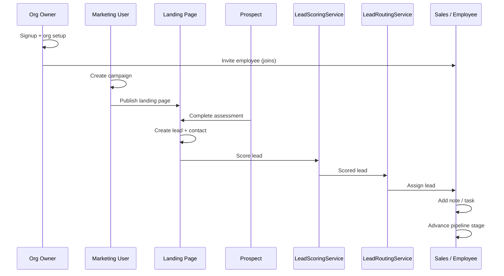
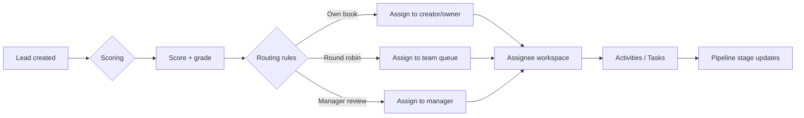

# Campaign and Lead Flow

## Target vertical slice

```text
Organization signup
→ Organization setup
→ Invite employee
→ Employee joins organization
→ Create campaign
→ Publish landing page
→ Business owner completes interactive assessment
→ Lead is created
→ Lead is scored
→ Lead is assigned
→ Employee sees lead
→ Employee adds note/task
→ Employee moves lead through pipeline
```

## Campaign → lead journey



## Lead routing flow



## Foundation vs deferred

| Capability | This milestone | Later |
| --- | --- | --- |
| Campaign / lead / opportunity tables | Schema + interfaces | Full UX |
| `LeadScoringService` | Interface + stub | Rules engine |
| `LeadRoutingService` | Interface + stub | Configurable routing |
| Landing pages / assessments | Out of scope | Feature branch |
| Pipeline UI | Placeholder nav | Feature branch |

## Data touchpoints

- `campaigns` — source of acquisition
- `leads` — qualified interest records
- `contacts` — people associated with leads/customers
- `opportunities` — monetized pipeline records
- `activities` / `tasks` — working the lead
- `pipelines` / `pipeline_stages` — progression model
