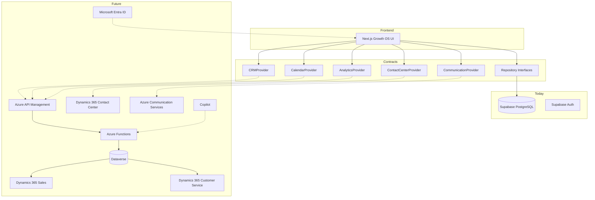

# Dynamics 365 Future State

## Intent

Design adapter boundaries now so Microsoft Dataverse and Dynamics 365 can be introduced later **without rebuilding the frontend**.

## Target Microsoft stack

- Microsoft Dataverse
- Dynamics 365 Sales
- Dynamics 365 Customer Service
- Dynamics 365 Contact Center
- Azure Communication Services
- Microsoft Entra ID
- Azure API Management
- Azure Functions
- Copilot capabilities

## Future architecture

## Adapter boundaries (do not implement yet)

| Interface | Future Microsoft mapping |
| --- | --- |
| `CRMProvider` / lead/contact/opportunity repos | Dataverse + Dynamics 365 Sales entities |
| `ContactCenterProvider` | Dynamics 365 Contact Center |
| `CommunicationProvider` | Azure Communication Services |
| `CalendarProvider` | Outlook / Dataverse appointments |
| `AnalyticsProvider` | Dataverse analytics / Fabric / Copilot insights |
| Auth session bridge | Entra ID federation alongside or instead of Supabase Auth |

## Sync strategy (planned, not built)

- Keep local UUIDs as system of record for the Growth OS UI where needed.
- Use `integration_connections` per organization.
- Use `external_record_mappings` for bidirectional ID mapping.
- Prefer application-layer dual-write or event sync behind repositories — never leak Dataverse IDs into React components.

## Non-goals for now

No live Dynamics connectors, no Entra login, no Azure Functions deployment, no Copilot plugins in this milestone.
