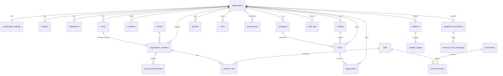
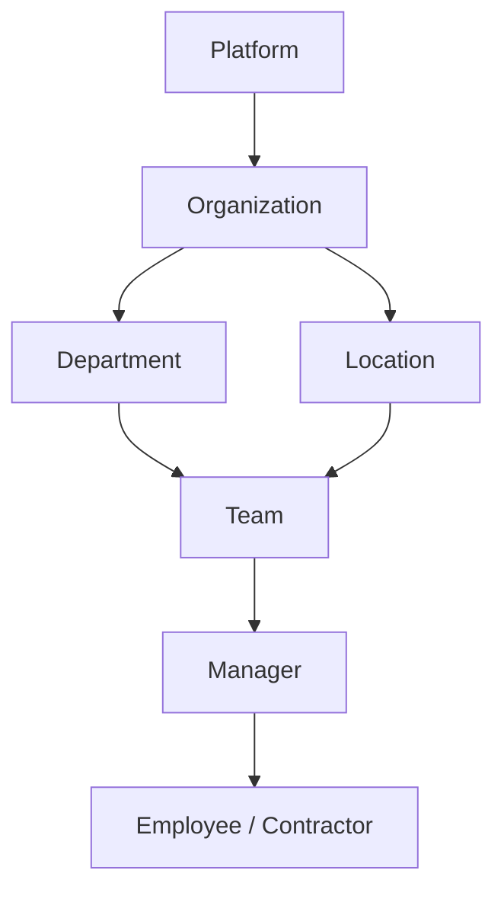
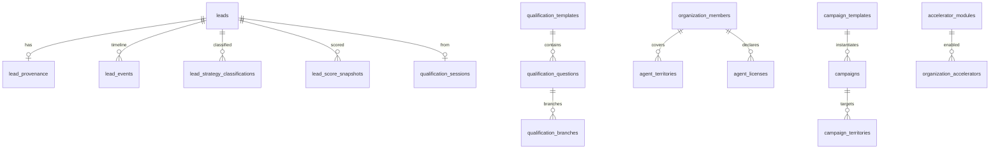

# Data Model

## Design rules

- UUID primary keys
- `organization_id` on every tenant-scoped table
- `created_at` / `updated_at` timestamps
- `created_by` / `updated_by` where actor attribution matters
- Soft deactivation preferred over hard deletes for people and org structure

## Core ERD

## Tables (initial)

| Table | Purpose |
| --- | --- |
| `organizations` | Tenant root |
| `organization_settings` | Branding, defaults, feature flags |
| `profiles` | Auth-linked user profile (global identity) |
| `organization_members` | Membership of a profile in an org |
| `locations` | Physical/virtual sites |
| `departments` | Org departments |
| `teams` | Working teams under departments/locations |
| `reporting_relationships` | Manager ↔ report edges |
| `roles` | Named role containers (system + custom-ready) |
| `permissions` | Permission keys |
| `role_permissions` | Role → permission grants |
| `member_roles` | Member → role assignments |
| `invitations` | Pending invites |
| `campaigns` | Marketing campaigns |
| `leads` | Inbound/qualified leads |
| `contacts` | People/accounts in CRM sense |
| `opportunities` | Pipeline deals |
| `activities` | Notes, calls, emails, system events |
| `tasks` | Actionable work items |
| `appointments` | Calendar events |
| `pipelines` | Pipeline definitions |
| `pipeline_stages` | Ordered stages |
| `audit_logs` | Security/compliance trail |
| `integration_connections` | External system connections |
| `external_record_mappings` | Local UUID ↔ external IDs |

## Organization hierarchy

## Notable relationships

- A `profile` can belong to multiple organizations via `organization_members`.
- Permissions are evaluated from the member’s roles within the **active** organization context.
- `external_record_mappings` enables dual-write / sync with Dynamics without coupling UI to Dataverse IDs.
- Campaign → Lead → Opportunity is the primary growth path; contacts may exist before or after lead creation.

## Indexing guidance

- Unique `(organization_id, slug)` or similar natural keys where needed
- Indexes on `organization_id` for all tenant tables
- Indexes on foreign keys used in list/filter screens (`assigned_to`, `team_id`, `campaign_id`, `stage_id`)

## Growth engine extensions (planned — additive)

See [migration-plan-growth-engine.md](./migration-plan-growth-engine.md).

**Rule:** do not add insurance-specific columns to core `leads`. Accelerators use templates, rule packs, and optional extension tables keyed by `module_key`.
