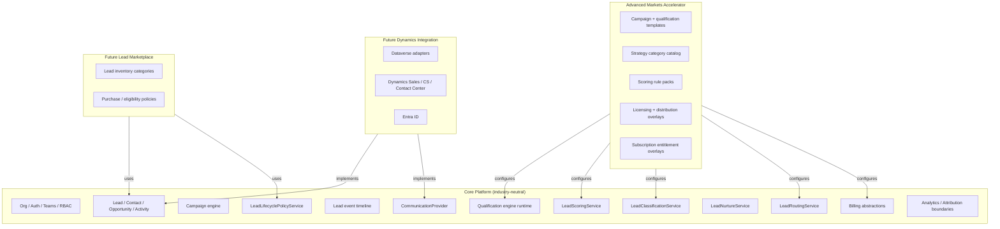

# Platform Layers — Ownership Map

Every feature must be explicitly owned by one layer. Accelerators may **configure** core engines; they must not fork core entities.

## Layer diagram

## Ownership matrix

| Capability | Core | Advanced Markets | Marketplace | Dynamics |
| --- | --- | --- | --- | --- |
| Organizations, members, roles, RLS | ✅ | | | |
| Lead / Contact / Opportunity entities | ✅ | extends via related records | may redistribute under policy | sync via adapters |
| Lead events + provenance | ✅ | emits vertical event metadata | preserves provenance | maps activities |
| Qualification runtime + branching | ✅ | supplies AM question packs | | |
| Strategy classification engine | ✅ | supplies AM strategy catalog | | |
| Scoring / temperature thresholds | ✅ | AM rule packs | may filter by score | |
| Routing + territory eligibility | ✅ | licensing overlays | eligibility gates | user mapping |
| Lifecycle / recycle policies | ✅ | default AM policies | recycle → inventory | |
| Campaign templates catalog | ✅ runtime | AM template library | | |
| SubscriptionPlan / packages | ✅ abstractions | AM entitlement maps | lead packages | |
| Lead marketplace purchase UX | | | ✅ future | |
| Dataverse / D365 sync | | | | ✅ future |
| AI explain/recommend actions | ✅ event boundaries | vertical prompts later | | Copilot later |

## Hard rules

1. Do **not** put Advanced Markets fields directly onto core `leads` as insurance-specific columns.
2. Prefer extension tables / JSON config packs / module namespaces keyed by `organization_id` + `module_key`.
3. Core services accept **rule packs** and **context**; accelerators register packs.
4. Marketplace never invents quality labels detached from objective events/scores.
5. Dynamics adapters implement existing interfaces — no frontend rewrite.
