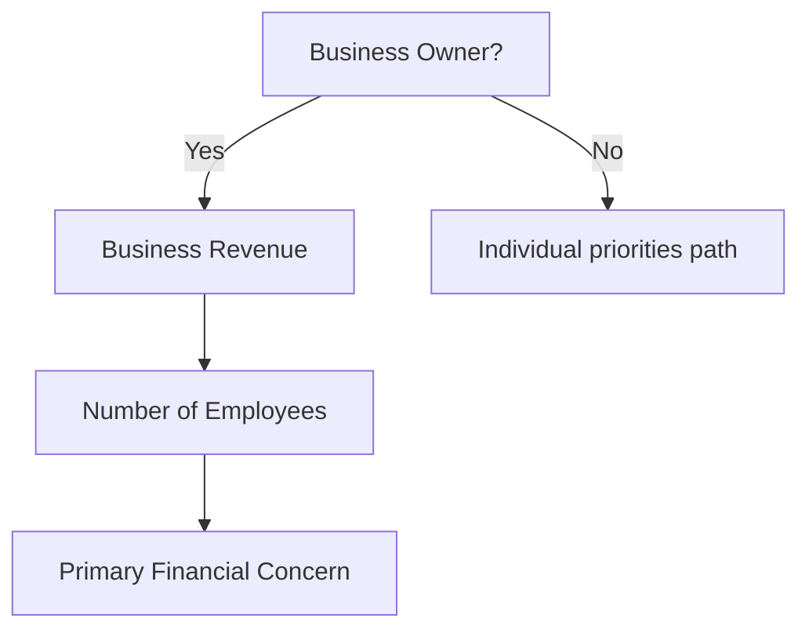

# Qualification Engine

## Purpose

Industry-neutral runtime for interactive qualification experiences. Accelerators (e.g. Advanced Markets) supply **templates and question packs**; core executes branching, capture, and event emission.

## Two-stage model

| Stage | Goal | Duration | Notes |
| --- | --- | --- | --- |
| **Stage 1 — Engagement** | Engage, intent, contact, soft strategy signal, appointment CTA | 30–90s · ~3–5 questions | Default path from ads/campaigns |
| **Stage 2 — Deep qualification** | Richer fact-find (optional) | Longer | Deferred; compliance-reviewed; never forced as first step |

## Interaction types (configurable)

- Single selection
- Multiple selection
- Slider
- Numeric input
- Yes/no
- Short text
- Currency / revenue range
- Conditional question
- Location / state
- Date/time scheduling

Questions are **data**, not UI hard-codes.

## Conditional branching

Branching rules live on the template graph (`show_if` / edge conditions). Different answers produce different subsequent questions.

## Advanced Markets Stage 1 topic coverage (content pack)

Capability to ask about (not finalized compliance copy):

Business ownership · revenue · employees · structure · financial priorities · tax concerns · estate · succession · executive benefits · retirement · liquidity · existing planning · time horizon · interest level · appointment urgency.

## Outputs into core

1. Lead (+ contact) when identity captured
2. Lead events for each meaningful step
3. Answers stored against `qualification_session` / versioned template
4. Signals for classification + scoring (never only questionnaire score)
5. Abandoned/partial states retained (`ABANDONED_ASSESSMENT`, `QUALIFIED_NOT_SCHEDULED`, etc.)

## Multi-tenancy

Templates may be platform-provided (accelerator catalog) or org-customized clones. All response data is `organization_id`-scoped with RLS.
